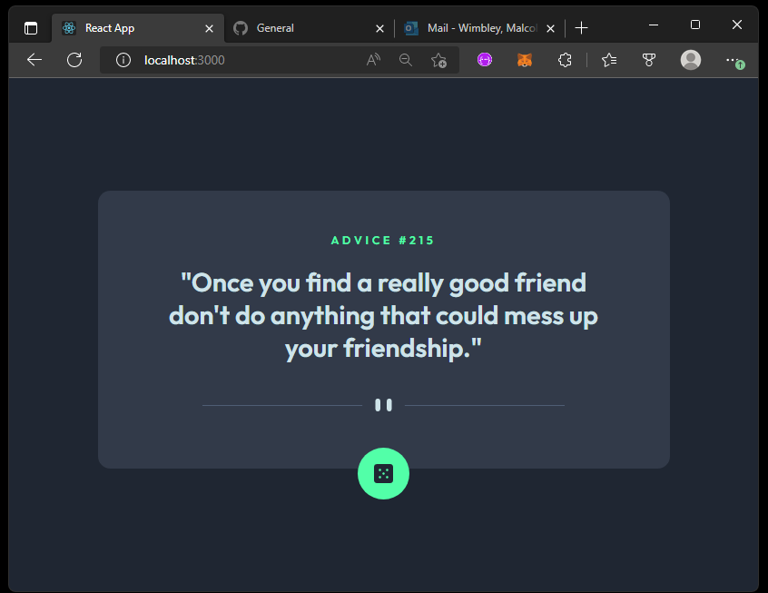

# Advice generator app solution

This is a solution to the [Advice generator app challenge on Frontend Mentor](https://www.frontendmentor.io/challenges/advice-generator-app-QdUG-13db). Frontend Mentor challenges help you improve your coding skills by building realistic projects.

  

## Table of contents

- [Overview](#overview)
  - [The challenge](#the-challenge)
  - [Screenshot](#screenshot)
  - [Links](#links)
- [Built with](#built-with)
- [Author](#author)

## Overview

### The challenge

Users should be able to:

- View the optimal layout for the app depending on their device's screen size
- See hover states for all interactive elements on the page
- Generate a new piece of advice by clicking the dice icon

### Screenshot

https://prnt.sc/q9nu9wb0zZcw
https://prnt.sc/AIsPHB8uTvCA

### Links

- Solution URL: (https://prnt.sc/AIsPHB8uTvCA)

### Built with

- Semantic HTML5 markup
- CSS custom properties
- Flexbox
- [framer](https://framer.com/) - JS library
- [Next.js](https://nextjs.org/) - React framework
- [Styled Components](https://styled-components.com/) - For styles

## Author

- Website - [Linkedin](https://www.linkedin.com/in/malcolmwimbley/)
- Frontend Mentor - [@Malcolmwimbley](https://www.frontendmentor.io/profile/Malcolmwimbley)
- Twitter - [@malcolm_wimbley](https://www.twitter.com/malcolm_wimbley)
